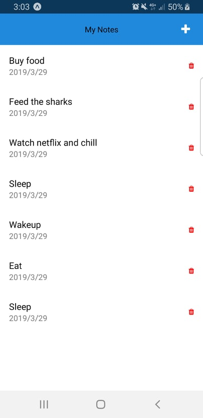

# React Native - Note Application with Bootstrap (CRUD)  
Development time version 0.59  

## UI  
### View 1 - Empty 
  

### View 2 - Populated
 

Documentation for Styling
[React Native Elements](https://react-native-training.github.io/react-native-elements/docs/getting_started.html)  

